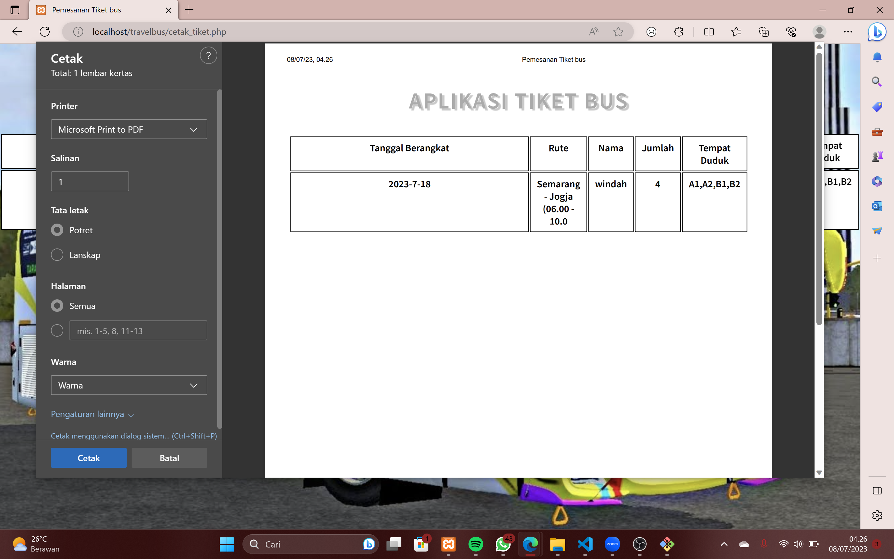

```
Tugas           : Project Akhir Pemograman Web 2

Judul Project   : Database Penjualan Tiket Bus

Kelas           : TI.21.A2

Mata Kuliah     : Pemograman Web 2

Dosen           : Agung Nugroho,S.Kom.,M.Kom

Kelompok 2      : • 312110268 - ANINDIA SASIKIRANA
                  • 312110166 - rahma fauziah
                  • 312110144 - tiara oktapiana
                  • 312110337 - riska putri
                  • 312110336 - mohammad adin
```

# Tentang App
Penjualan tiket bis mengacu pada proses atau kegiatan menjual tiket perjalanan menggunakan transportasi bis. Ini umumnya dilakukan oleh perusahaan transportasi atau agen perjalanan yang menawarkan layanan bus untuk perjalanan jarak jauh atau antarkota.

- HOME 
halaman ini berisi pemesanan tiket bus 
dari tujuan keberangkatan, pilih tanggal, nama, jumlah kursi, kursi yang ingin dipilih 

- CETAK TIKET 
berisi pesanan tiket 

# Fitur 

- Tujuan Keberangkatan
- Tanggal
- Nama Penumpang
- Jumlah Kursi
- Pilih Tempat Duduk
- Laporan Transaksi

# Cara Pesan Tiket Bus

Buka https://tiketbusanindia.000webhostapp.com/
1. memilih tujuan keberangkatan dari opsi yang tersedia.
2. memilih tanggal keberangkatan menggunakan kalender atau input tanggal yang tersedia. Pengguna akan memilih tanggal yang diinginkan untuk perjalanan mereka.
3. masukkan nama penumpang yang akan memesan tiket bus.
4. Pengguna akan memasukkan jumlah kursi yang ingin dipesan.
5. Pengguna akan memilih tempat duduk yang tersedia pada bus.
6. Setelah pengguna selesai memilih tujuan, tanggal, nama penumpang, jumlah kursi, dan tempat duduk, laporan transaksi dapat dibuat.
Dalam laporan transaksi, informasi seperti tujuan keberangkatan, tanggal, nama penumpang, jumlah kursi, dan tempat duduk yang dipilih akan ditampilkan.

# HALAMAN PEMESANAN TIKET 


## masukkan tujuan keberangkatan, pilih tanggal, nama, jumlah kursi, kursi yang ingin dipilih 


# PESANAN TIKET YANG TADI SUDAH DIPESAN 


# LAPORAN TRANSAKSI 


# DATABASE


# LINKS
web : https://tiketbusanindia.000webhostapp.com/
youtube : https://youtu.be/nRemZdTsSi8
